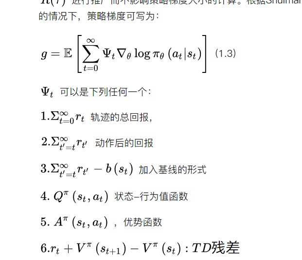
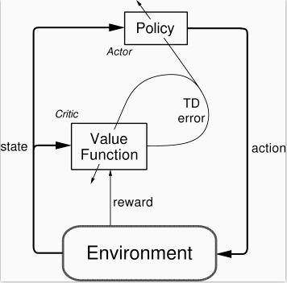
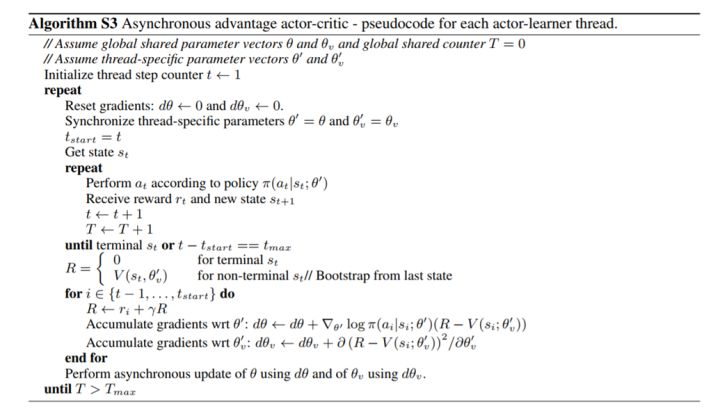

>   来自前面的碎碎念：毕竟是blog里面的第一篇文章，总不能随随便便就放上去；回头翻了翻手头的笔记 emmmm，主要是Carla的还在封装NIRL，然后写完后 函数还没封装完成 input和output乱到不行，又忙的没有一次性来完成的时间，索性就把之前写完的 看到A3C先拿出来当做第一篇blog；

## 起源

说起A3C，首先不得不说的肯定就是actor-critic，A3C的全名是Asynchronous Advantage Actor-Critic ，顾名思义 是异步的架构；并非像DQN那样仅单智能体与单环境交互，A3C可以产生多交互过程；如图可知 A3C包括一个主网络 和多个工作的有着各自参数的agent，同时的和各自的环境进行交互；相比于单个的agent 这种方法更有效之处在于 因为来自各自独立的环境 于是采集得到的经验也是独立的 于是采集得到的经验也更多元化； 

这里先不说前两者：并行和优势函数，而是从基础的AC出发 从actor-critic开始讲起；

### Actor-Critic的来源

对于强化学习有所了解可以了解到，对于策略的求解可分为：**基于值函数**和**基于策略**的方法：

前者：借助函数逼近值函数 进而求取梯度优化其中的参数进而获取描述值函数更优秀的方法 来得到描述值函数更优秀的参数；**当值函数最优的时候，策略就是最优的；**总之迭代更新的是值函数，间接的完成对于策略的更新；

后者：求解策略梯度 也就是把策略参数化 对其迭代更关系 让累计回报的期望最大；也就说直接的对于策略进行迭代计算 更新优化；

>   「找个机会把 value-based和policy-based两者好好总结一下；6_26」

两者的交叉也就是actor-critic。也就说是 以值函数为中心 结合上 以策略梯度为中心；

actor是基于策略梯度的方法进行选取动作，而critic是基于值函数的方法来评价它，两者协作完成；

于是我们可用先从策略梯度的角度来理解：

*   普通的策略梯度中loss function的表示是 $logP(\tau;\theta )R(\tau)$ 前者代指的是方向,进而基于θ求偏导的话 毋庸置疑也就是让轨迹τ的概率变化最快的方向，或快速增加或快速减少，只是取决于正负号；后者的是$$R(\tau)$$ 作为一个标量 类似于前者的增幅 当其为正的时候，当这个值越大的时候 轨迹τ出现的概率$P(\tau;\theta)$ 在参数更新之后会越大「建立的函数是两者相乘 但更新的参数只是在前者这个描述出现概率的变量中出现」反之则越来越小。所以，策略梯度的方法会增大高回报轨迹对应的出现概率 而会降低低回报轨迹对应的出现概率；

*   从这个角度再来理解actor-critic，轨迹的回报$$R(\tau)$$ 可看做一个critic；用于评价参数θ更新后 该轨迹出现的概率是该增大还是减少 以及对应的幅度；对应的可以表示成：

    

    >   对于他们的评价如下：
    >
    >   1--3：直接应用轨迹的回报累积回报，由此计算出来的策略梯度不存在偏差，但是由于需要累积多步的回报，因此方差会很大。
    >
    >   4—6: 利用动作值函数，优势函数和TD偏差代替累积回报，其优点是方差小，但是这三种方法中都用到了逼近方法，因此计算出来的策略梯度都存在偏差。这三种方法以牺牲偏差来换取小的方差。当$ \varPsi_t $取4—6时，为经典的AC方法。

​    

于是一个广义的AC框架 就是：前面的 $$\pi_{\theta}(a|s)$$ 是actor作为策略函数；
后面的 $$\varPsi _t$$ 是critic 评价函数 「换句话说 critic使用的就是各种策略评估方法」

### Actor - Critic的优点

（总的来说就是结合两种方式优点）：

-   相比以值函数为中心的算法，Actor - Critic应用了策略梯度的做法，这能让它在连续动作或者高维动作空间中选取合适的动作, 而 Q-learning 做这件事会很困难甚至瘫痪。
-   相比单纯策略梯度，Actor - Critic应用了Q-learning或其他策略评估的做法，使得Actor Critic能进行单步更新而不是回合更新，比单纯的Policy Gradient的效率要高。

    

因为AC的方法，是在之前的策略梯度的方法之上 将其中的用于描述轨迹累计reward的项 转化为了行为价值函数 $$Q_{\omega}(s,a)$$  同时这里的状态值函数，接下来是一个简单实现的算法 行为值函数采用线性表达 于是更更新的过程中：critic通过近似TD(0)来更新ω，actor借助策略梯度更新θ，整体描述有：

可以看到 正是个实时的在线学习；针对每一步 一方面基于策略选取动作a和a‘，这时候的策略选取不再需要ε-greedy来获得，而是直接借助参数θ得到；然后得到TD-error，先类似于策略梯度中那样更新actor的参数θ；再更新critic中的参数ω用于生成值函数；

### Actor - Critic的总结

「回头看整个AC架构，就是在策略梯度更新的基础上 将其中的的元被用于描述整个轨迹的累计reward的$R(\tau)$ 改写成动作值函数；前者的策略梯度本身就是对于策略本身的描述 于是借助于它 我们能基于状态得到action；然后改写成的动作值函数 可以得到对于该state-action的评价值；进而回头类似于策略梯度的更新 更新这个策略」

再回头对比想想看和之前两者的区别：

1.  和策略梯度的区别，很明显 关于策略梯度的算法表述里面 并没有涉及关于critic部分或者具体点说就是值函数更新的部分；参考RL:an introduction 里面所描述的那样P292中所描述的那样： 策略梯度方法里 状态值函数更多的是作为一种基准而非是critic；也就是说只是作为一种基准来判断哪个状态需要被更新「for state-function」**而事实上 为了实现Policy Gradient，不管我们是计算Q，还是V，都需要一个对应的网络，这就是Critic。换句话讲，我们只有在使用Policy Gradient时完全不使用Q，仅使用reward真实值来评价，才叫做Policy Gradient，要不然Policy Gradient就需要有Q网络或者V网络，就是Actor Critic。** **「对于其中采用什么值来当做$R(\tau)$ 参考这来理解https://zhuanlan.zhihu.com/p/26882898」**
2.  和值函数的方法 差别就更大了；首先对于策略的描述 就不是值函数方法里面借助 $$argmax_a Q(s,a)$$ 而是使用的策略梯度的方法；当然使用对于该策略的好坏的评价 但也是一样的值函数；

然后对于一整个actor-critic的训练过程如下：

如图 基于策略梯度的actor基于概率来对于某状态来选取动作action；而critic基于actor的行为判别行为的得分；actor进而基于该评价值来计算出来一个td error修改选择行为的概率「换句话说就是：actor的策略梯度的方法生成得到梯度的方向「也就说之前的$logP(\tau;\theta )$」，然后进行沿着方向进行梯度的增减；我们需要一个值来判断这一个增减的方向是否正确 于是需要critic来计算出来td error」，同时基于选取的action计算TD error来更新critic；

具体到网络里面：Actor和Critic各为一个网络，Actor输入是状态输出的是动作，loss就是$$log_{prob}*td_{error}$$,(和策略梯度相对应，注意到这里的loss和Policy Gradient中的差不多，只是vt换成td_error，引导奖励值vt换了来源（Critic给的）而已)，Critic输入的是状态输出的是Q值，loss是square((r+gamma*Q_next) - Q_eval)也就是square(td_error)，也就是说这里更新critic对应Q-learning是一样的均方误差。 

网络的交互也和上图一致：agent每次状态1从actor中得到一个动作a1 和env类交互得到s2和即时奖励r。然后把s1s2 r输入critic网络，更新其中的参数ω并计算得到td_error；然后把a1，s1，td_error输入到actor网络更新其中的参数θ；「TD_error信号同时指导actor网络critic网络的更新 」

具体代码可以参考：https://github.com/MorvanZhou/Reinforcement-learning-with-tensorflow/blob/master/contents/8_Actor_Critic_Advantage/AC_CartPole.py

actor类和critic类写的很好；这里不再赘述 毕竟放在马上的A3C实现里面来说：

然后就是A3C的描述；

## A3C（Asynchronous Advantage Actor Critic）算法简述

DQN相比于传统的RL算法有了巨大的提升一个主要原因在于：采用了打破数据关联性经验回放技巧；而这打破数据相关性的方法 并不只是只有经验回放；异步方法同样可以打破数据相关性，毕竟数据不同时产生的；简单来说，A3C算法完全使用了Actor-Critic框架，并且引入了异步训练的思想，在提升性能的同时也大大加快了训练速度。 参考下面的伪代码

经典的A3C算法 是在actor-critic的基础上 采用了并行的结构运行，即它不在利用单个线程，而是利用多个线程。每个线程相当于一个智能体在随机探索，多个智能体共同探索，并行计算策略梯度，维持一个总的更新量。 

由经验可知道：online的RL算法「更新策略和选取策略一致」在和DNN简单结合后会不稳定。主要原因是观察数据往往波动很大且前后sample相互关联。像Neural fitted Q iteration和TRPO方法通过将经验数据batch，或者像DQN中通过experience replay memory对之随机采样，这些方法有效解决了前面所说的两个问题，但是也将算法限定在了off-policy方法中。 文章中，通过创建多个agent，在多个环境实例中并行且异步的执行和学习。于是，通过这种方式，在DNN下，解锁了一大批online/offline的RL算法（如Sarsa, AC, Q-learning） ；

>   「对于单个agent进行样本采样 获取的样本很可能就是高度相关的；而 machine learning 学习的条件是：sample 满足独立同分布的性质。在 DQN 中，我们引入了 experience replay 来克服这个难题。但是，这样子就是 offline 的了，因为你是先 sampling，然后将其存储起来，然后再 update 你的参数。  」

文章中不只是包含一种算法，而是将one-step Sarsa, one-step Q-learning, n-step Q-learning和advantage AC扩展至多线程异步架构。 可以看到几种方法的不同： **「AC是on-policy的policy搜索方法，而Q-learning是off-policy value-based方法。这也体现了该框架的通用性。 」**

简单地说，每个线程都有agent运行在环境的拷贝中，每一步生成一个参数的梯度，多个线程的这些梯度累加起来，一定步数后一起更新共享参数。 

A3C所主要针对的还是产生多个独立环境，有多个 agent 对网络进行 asynchronous update，这样带来了样本间的相关性较低的好处，因此 A3C 中也没有采用 Experience Replay 的机制；这样 A3C 便支持 online 的训练模式了 ；

具体点说的话 就是启动了多个训练环境，同时进行采样 然后直接使用各个环境采集得到的样本进行计算梯度 训练更新相关的参数「actor中的policy gradient和critic中的值函数」

实践中的话 就是要有两套体系, 可以看作中央大脑拥有 `global net` 和他的参数, 每位玩家有一个 `global net` 的副本 `local net`, 可以定时向 `global net` 推送更新, 然后定时从 `global net` 那获取综合版的更新. 