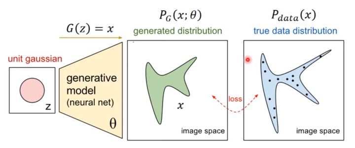

>先碎碎念几句，七月末的家里还真的是热 好容易下一场雨 迫不及待打开落地窗，被雨扫一脸的感觉 真滴还是不爽的；还是老老实实关上门窗 开空调吧；

在写完A3C后，并没有继续就是写RL的其他算法以及框架，而是之前在微信群里看到个：GAN代码实现的课程；于是也想着就把之前写的GAN的相关笔记整理一下放在这里；

## 对于GAN的原理的介绍

首先对于其起源，来自于Ian Goodfellow大牛的Generative Adversarial Networks（arxiv：[https://arxiv.org/abs/1406.2661](https://link.zhihu.com/?target=https%3A//arxiv.org/abs/1406.2661)），这篇paper算是这个领域的开山之作。 

而对于GAN来说 最重要的当然就是两个部分：生成器以及判别器 G（Generator）和D（Discriminator） ；

以图片为例的话，前者这个生成器的生成网络：需要通过接受随机噪声z 用于生成图片，记做G(z)；后者这个判别器的判别网络，用于判断图片是否为True：接收图片x，输出D(x)表示x为真实图片的概率，若为1 则表示100%为真实图片，反之则不可能是；

**总结性的说的话，生成网络G的目标就是为了生成尽可能真实的图片X用于欺骗判别网络D；而判别网络D的目标就是尽可能吧生成网络G生成的图片X和真实的图片分开；**两者达到了一种动态的 博弈过程 ；

**博弈：既要尽可能的区分真实样本和生成样本（判别器），还要尽可能缩小两者之间的差距（生成器）**

所以最理想的状态莫过于：G(z)生成了 以假乱真 的图片。导致D(G(z))难以判别，于是D(G(z))=0.5；

进一步的来对于这个话题进行延伸 不在仅限于图片，我们将其看做数据集，于是：就希望生成器G生成和真实数据没有区别的样本，对于真实数据集来说 其分布为$P_{data}$；我们希望借由生成器来生成这个分布内的数据，那么换句话说 我们希望生成器输出的数据和真是数据概率密度函数相同，有着$P_G=P_{data}$ ，于是我们可用大似然估计，通过计算一个似然$P_G(x;\theta)$ x来自于真实分布，让这个似然函数最大化，换句话说就是基于这个生成模型的分布生成来自真实分布的数据的概率最大化；

>   这里简单介绍下关于最大似然和似然函数的东西，具体的可以参考花书**P83**；
>
>   首先是对于似然函数：可以看做在给定样本值X情况下关于位置参数θ的函数$L(\theta|X)$ 就函数值而言 其和概率密度$f(X|\theta)$是一样的；恩 这里针对的是连续情况下，如果是离散呢 那就是单纯的概率$P(X|\theta)$；我们希望得到某分布下关于这些样本的似然函数，换言之 就是推导的分布「有关θ的分布$P(x;\theta)$」得到这样一组样本观测值的概率，于是也就是有$P(x1=X1,x2=X2,...,xn=Xn)$」『进一步的理解可以参考这两个网页 [1](https://www.zhihu.com/question/54082000) 和 [2](https://www.zhihu.com/question/20447622)』「某分布生成某个样本的可能性」
>
>   再次回到生成器上，为什么我们想要使用似然函数 并希望其最大化；
>
>   对于真实数据集而言，其分布为$P_{data}$；我们希望借由生成器来生成这个分布内的数据；设生成器得到的分布为$P_G(x;\theta)$，θ为分布的参数，这时候我们从原先分布中取一些数据X「来自于真实数据集」，这样 若想计算关于这些真实数据在生成模型中的似然，关于生成模型的似然计算就是针对X中全部数据$\{x^1,x^2,...,x^m\}$，于是有$L=\prod^m_{i=1}P_G(x^i;\theta)$，所以这些真实数据在生成模型中的似然就是$L=\prod^m_{i=1}P_G(x^i;\theta)$；「其中「∏」代表累乘、P_G(x^i;θ) 代表第 i 个样本在生成分布出现的概率。从该似然函数可知，我们抽取的 m 个真实样本在 P_G(x;θ) 分布中全部出现的概率值可以表达为 L 」
>
>   而就像上面所说的一样，我们希望generator尽可能的生成和真实图片一样的图片，于是也就是让generator生成这些真实图片的可能性尽可能的大，进一步的说也就是生成已有真实图片$\{x^1,x^2,...,x^m\}$尽可能的大「希望生成器的分布生成某个图片的概率尽可能的大 ，如果是让一些个图片$\{x^1,x^2,...,x^m\}$的生成概率尽可能的大呢？那也就是让生成器的分布生成这也一组样本图片的概率尽可能的大，而生成这样一组样本观测值的概率为$P(x=X1,x=X2,...,x=Xn)$ 所以也就是累乘」

于是，我们希望找到一个$\theta^*$来让这个似然函数最大，于是有：

对于上面等式的一些理解：

-   显而易见的对似然函数取log 原先的累乘变为了累加；同时缩放函数 对于似然估计的argmax并不会产生影响 于是除以m 也就等同于 真实分布中的所有x在$P_G$分布中的log似然的期望；
-   真实分布中的所有x的期望，等价于求概率积分，于是转化为积分运算；在第五行后面加上一个与theta无关的项 不影响θ取值；紧接着提取共有的项，括号内的翻转 max变为min 变为求解KL散度的形式 参考花书P83的5.60公式
-   对于生成器的最大似然函数可以看做：最小化真实图片分布和生成器分布之间的差异；之间的差异 使用KL散度来度量；

而取到这个θ的过程 也就是生成器网络优化的过程，毕竟我们把生成器设置为一个神经网络，显然计算似然对神经网络的参数进行估计很难，于是采用D和G对抗的方式 来训练生成器G；

这个时候在翻看其中优化的值函数$V(D,G)$ 「等号右边那些描述的是V 而不是minmaxV」：

$min_Gmax_DV(D,G)=E_{x~p_{data}(x)}[logD(x)]+E_{z~p_z(z)}[log(1-D(G(z)))]$

>   -   x代表了真实图片，z表示了输入生成网络的噪声，G(z)表示了生成网络输出的图片；
>   -   D(x)表示了判别网络 判断真实图片的概率，因为x代表的是真实图片 所以理论上这个值越接近1越好；而同样D(G(z))是 判别网络判断生成网络生成的图片的是否真实的概率。 
>   -   然后就是式子本身的两个判别：min_{G}V：对于生成网络来说，期待找到相关的网络参数来让G生成的图片尽可能的的接近真实图片，于是D(G(z))也就尽可能的大了，于是log(1-D(G(z)))就会变小 整体的V也会变小；**因而 G为了达到 「生成尽可能真实的的图片」这一个目的 也就是让log(1-D(G(z)))尽可能的小， 我们需要min_G**;
>   -   max_{D}V：对于判别器网络来说，我们需要它尽可能的对于真实图片判别的概率增加；于是logD(x)也会不断增加，于是V也会不断增加；**因而，D为了达到「对于真实图片的判别能力尽可能的大」这一目的 也就是让logD(x)尽可能的大，我们需要max_D**;

输入z后得到输出图片x也是生成器的主要作用；如何进行优化呢？也就是从随机取一组sample z 有着相关的分布 将其与真实分布$P_{data}$联系起来 类似于input和label，然后吧input的噪声z输入神经网络得到输出分布也就是$P_G$；比较这个结果和真实的当做label的分布之间的差距；

>   当然虽然说是随机噪声采样z，当然 完全随机的话 还是很困扰的 于是一般这里的随机输入只是取一些常见的分布：均值分布 高斯分布等；

而对于如何取到更为接近的分布 也就是GAN的操作了；我们知道关于神经网络的万能近似定理，于是 我们只要有着多层隐层带来的足够复杂度 和非线性激活函数带来的非线性，就可以用上面所提到的正态分布，或者高斯分布，取样去训练一个神经网络，学习到一个很复杂的分布。 如下图

如何找到这样一个优化函数也就成为了重点；回头看上面用于优化的值函数：$min_Gmax_DV(D,G)=E_{x~p_{data}(x)}[logD(x)]+E_{z~p_z(z)}[log(1-D(G(z)))]$

## 对于优化的值函数的理解

我们从等号左右两边来进行理解，首先是等号右边的部分直观的理解：

### 等号右边

#### 对于等号右边直观地理解

对于generator来说 目的无疑是希望当接受来自$G(z)$ 的时候，被判断为正确的概率尽可能大也就是说$max_G E_{z~p_z(z)} (log(D(G(z))))$ ，换句话说就是希望有着 $min_G E_{z~p_z(z)} (log(1-D(G(z))))$ ; 

而在此基础上，discriminator的目的是希望让$G(z)$ 被判断为真的概率$D(G(z))$尽可能的小 也就是说反之 希望$(1-D(G(z)))$ 尽可能的大，同时也希望 让来自真实数据$x$被判断为真的概率$D(x)$ 尽可能的大，于是也就是让$E_{x~p_{data}(x)}[logD(x)]+E_{z~p_z(z)}[log(1-D(G(z)))]$ 这个整体尽可能的max；对于generator来说 $E_{x~p_{data}(x)}log(D(x))$ 中和G无关，于是添加上去也无所谓，于是得到整体的式子：$min_Gmax_D[E_{x~p_{data}(x)}[logD(x)]+E_{z~p_z(z)}[log(1-D(G(z)))]]$

#### 对于等号右边基于交叉损失函数的理解

对于discriminator的损失函数来说 可以看做交叉熵损失函数，基于[这个网站](https://danieltakeshi.github.io/2017/03/05/understanding-generative-adversarial-networks/?utm_source=qq&utm_medium=social&utm_oi=59112268234752)进行理解;

>   对于交叉熵来说 其式子记做$H(p,q)=-\sum p_ilogq_i$；前者p表示真实分布 后者q表示估计分布；进而对于一个样本的二分类问题，就有着$H((x_1,y_1),D)=-y_1logD(x_1)-(1-y_1)log(1-D(x_1))$ 
>
>   「log后面的部分代表着来自于$D$ 的估计分布」**「注意 这是来自于x_1的选择才会导致着y_1和1-y_1的不同选择结果，换句话说 一个$x_1$ 可能对应y_1和1-y_1两种分类情况；而同时 对应的估计分布也是D(x_1)和1-D(x_1)；那么当y_1和1-y_1分开对应两种不同的分布p_1和p_2之后，其各自输入的x也不一样分别为x和x'，那么对应两者的估计分布也就变成了D(x)和 1-D(x') 」**
>
>   其中的y_1表示真实样本的分布$True$，那么后者的(1-y_1)就是非真实分布$False$  也就是生成模型的分布 同样**后面的$D(x_1)$ 表示来自于D的估计分布 这里被用于表示了判别样本为真实分布的概率，$1-D(x_1)$ 被用于表示了判别为非真实分布的概率**；对于某个确定样本集的N个样本之后 于是把式子累加 变为了$H((x_i,y_i)^N_{i=1},D)=-\sum_{i=1}^Ny_ilogD(x_i)-\sum_{i=1}^N(1-y_i)log(1-D(x_i))$ 

我们可用对上面的式子进行理解，作为二分类问题 我们使用输入样本$x_i$ 其有着其对应的分布$y$；我们试图借助discriminator来对于这分布进行模拟各自对应的两种情况的生成分布分别为$D(x_i)$和$(1-D(x_i))$ ；进而对于GAN之中，样本点$x_i$ 只可能有两个结果一个是真实样本 一个就是利用生成器生成出来的样本$\tilde{x}=G(z)$ 「这里的z表示被放入生成器中噪声的分布」，对应的分布也就是$y_i$ 和$1-y_i$ ；于是用于描述判定概率的 对应来自于D的估计分布 也就是$D(x)$ 和 $1-D(\tilde{x})$ 「我知道你在想什么 毕竟原先是和在一起的 同一个x分布 于是分别用D(x)和1-D(x)还情有可原，现在分开了 为什么还是这样表示呢？**请注意：你所针对的正类还是负类是样本x对于y_i和1-y_i而言的，而这两者对应的估计分布是D(x)和 1-D(x)；所以当你把y_i和1-y_i分开看成y和y‘后，其对应的样本也被分开成为对应正类的样本x和对应负类的样本x’各自独立 ；同样的对于两者的估计分布 中的总体样本x也被替换对应类别的x和x’**」

这样来自真实样本的看做是正确分布$y_i$ 和分布对应的概率；来自生成样本的看做为错误分布也就是$1-y_i$ 和其分布对应的概率；进一步的 上面的式子进行变形为：

$-\sum_{i=1}^NP_{data}logD(x)-\sum_{i=1}^NP_Glog(1-D(x‘)) \rightarrow -E_{x~p_{data}}[logD(x)]-E_z[log(1-D(G(z)))]$ 

「噪声z分布被输入到生成器G 得到生成器的分布P_G 于是这里写作z~p_z」

### 等号左边

进而我们看式子等号左边的内容，对于左边的minmax的式子 首先 V(G,D)是用来表示真实样本和生成样本之间差距的函数；进一步的 参考Generative Adversarial Nets  文章中的algorithm1对于GAN网络的更新方法；「站在判别器D的角度来想 肯定是让描述真实样本和生成样本之间差距的V尽可能的大；站在生成器G的角度，肯定是让描述真实样本和生成样本之间差距V尽可能的小；」

首先是固定生成器G 训练判别器D 使其尽可能的区分真实样本和生成的样本；然后再固定判别器 对于生成器进行更新 来最小化真实样本和生成样本之间的差异；「这里的minmax的顺序其实也就是更新的先后顺序」「这里也能体现生成器和判别器的目的 生成器G是尽可能让生成样本被真实样本接近于是是min，判别器D是尽可能区分真实样本和生成样本 于是是max」

就像更新算法里面先对于判别器D进行更新的一样，我们也按照这个角度来理解：首先有$max_DV(D,G)$ 我们固定生成器G 对于式子变形为$E_{x~p_{data}(x)}[logD(x)]+E_{x~P_G}[log(1-D(x))]$ ：

>   毕竟这里我们针对的是x的来源 对于样本点来说 其来源只有两个地方：要么是真实的样本 要么就是生成器的分布，而z被投入生成器 用于生成新的图片 所以这里的噪声分布看做来自生成器的分布也一样；D(x)表示了样本是真实样本的概率 那么1-D(x)就是来自生成器的分布的概率

于是这里的$max_DV(D,G)$ 理所当然可以看做$P_G$和$P_{data}$之间的差异，恩 就是交叉熵 ；确定好这一个部分之后，看作一个整体让$L=max_D V(D,G)$ 这时候相当于固定了判别器D 站在生成器的角度来想 想要得到生成器G 来让两者之间的差距尽可能的小；于是$min_G L$ 也有$G^*=arg min_G L$ ;

再次回头看整体的式子$min_Gmax_DV(D,G)=E_{x~p_{data}(x)}[logD(x)]+E_{z~p_z(z)}[log(1-D(G(z)))]$ ：

对于其中的D和G 总结性的描述就是：D和G的矛盾的地方主要在于生成分布的概率；D希望让这个式子尽可能的大，于是就让真实分布的概率尽可能的为1，生成的分布概率就是为0；而G希望生成的分布和真实的分布接近 那么也就导致G希望分布的概率也是为1；

然后再来看整体的优化过程；先固定G 求解最优的D：

对于V的变形如下

因为给定x之后 最优的判别器$D^*$ 需要最大化其中的交叉熵的式子；进而为了最大化交叉熵的式子，对其求导 可得到最优的判别器$D^*$ ：

然后 我们把求得的最优的判别器$D^*$ 代入$max_D V(G,D)$ 可以得到：

「这里的除2 是为了后面的理解 其实也就是为了变形为JS 然后消去这个和」可以看到 上面的两个式子分别表示了：真实分布和两者和分布的均值 的KL散度 以及 生成分布 和 两者和分布的均值 的KL散度；

JS divergence是KL divergence的对称平滑版本，表示了两个分布之间的差异， 这里对其进行JS散度的变形：

可以看到，作为描述两个分布之间差距的JS散度，上面推导展示了：固定生成器G 的表示两个分布之间差异的$L=max_DV(D,G)$ 的函数最小值是-2log2，最大值为0 ；「当两者相同的时候 两个log都是有log1=0 就是最小值；emmm 什么时候得到最大值 还真没想出来」

然后 对于G的优化 需要最小化$L$ 显然的是最小值为-2log2，且当$P_G=P_{data}$ 的时候 $log \frac{P_G或P_{data}}{(P_G+P_{data})/2}$ 就是为0；因而求得总体的式子就是当$P_G=P_{data}$ 才满足要求；

## 其他

感觉讲的很乱，写一半的时候出去跑步 回来正好又遇到下雨 尽管及时洗澡 还是感觉头蒙蒙的；有时间的话 把这篇再好好整理一下吧，或者说在实现的里面再说说，最后列举一下 当时看的时候的一些参考文章：

基于[网页](https://zhuanlan.zhihu.com/p/24767059)的一些基础概念的描述：

https://zhuanlan.zhihu.com/p/29837245?utm_source=qq&utm_medium=social&utm_oi=59112268234752

联系网页 https://zhuanlan.zhihu.com/p/30107433 和 https://zhuanlan.zhihu.com/p/29837245?utm_source=qq&utm_medium=social&utm_oi=59112268234752 以及https://zhuanlan.zhihu.com/p/27295635 理解的最大似然；

参照https://zhuanlan.zhihu.com/p/29837245?utm_source=qq&utm_medium=social&utm_oi=59112268234752 和 https://zhuanlan.zhihu.com/p/27295635 和本文里面最大熵的内容进行重新理解；

